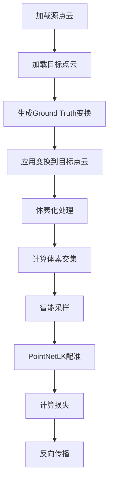

# C3VD数据集集成指南

本文档介绍如何在PointNetLK_compare项目中使用C3VD医学点云数据集进行训练和测试。

## 📋 目录

- [概览](#概览)
- [数据集准备](#数据集准备)
- [配准方式详解](#配准方式详解)
- [快速开始](#快速开始)
- [详细配置](#详细配置)
- [训练示例](#训练示例)
- [测试示例](#测试示例)
- [体素化配置](#体素化配置)
- [性能优化](#性能优化)
- [故障排除](#故障排除)

## 🎯 概览

C3VD数据集集成提供了以下功能：

- ✅ **完整的体素化支持** - 基于PointNetLK_Revisited的先进体素化算法
- ✅ **智能采样策略** - 优先保留交集体素，提高配准精度
- ✅ **多种配对策略** - 支持一对一、场景参考、数据增强等配对方式
- ✅ **Ground Truth变换** - 自动生成配准任务的变换矩阵
- ✅ **专用训练/测试脚本** - 简化C3VD数据集的使用流程
- ✅ **全面的评估指标** - 旋转误差、平移误差、成功率等

## 📁 数据集准备

### 数据集结构

确保你的C3VD数据集具有以下结构：

```
C3VD_sever_datasets/
├── C3VD_ply_source/                    # 深度点云数据（源点云）
│   ├── cecum_t1_a/
│   │   ├── 0000_depth_pcd.ply
│   │   ├── 0001_depth_pcd.ply
│   │   └── ...
│   ├── cecum_t1_b/
│   ├── desc_t4_a/
│   ├── sigmoid_t1_a/
│   ├── trans_t1_a/
│   └── ...
├── visible_point_cloud_ply_depth/      # 可见点云数据（目标点云）
│   ├── cecum_t1_a/
│   │   ├── frame_0000_visible.ply
│   │   ├── frame_0001_visible.ply
│   │   └── ...
│   ├── cecum_t1_b/
│   └── ...
└── C3VD_ref/                           # 参考点云数据（场景参考配对用）
    ├── cecum_t1_a/
    │   └── coverage_mesh.ply           # 场景参考点云
    ├── cecum_t1_b/
    │   └── coverage_mesh.ply
    ├── desc_t4_a/
    │   └── coverage_mesh.ply
    └── ...
```

### 数据集目录说明

| 目录 | 用途 | 文件格式 | 说明 |
|------|------|----------|------|
| `C3VD_ply_source/` | 源点云 | `*_depth_pcd.ply` | 深度传感器获取的完整点云数据 |
| `visible_point_cloud_ply_depth/` | 目标点云 | `frame_*_visible.ply` | 视觉系统看到的可见点云数据 |
| `C3VD_ref/` | 参考点云 | `coverage_mesh.ply` | 场景参考配对策略使用的参考点云 |

### 数据集验证

使用以下命令验证数据集结构：

```bash
python -c "
from pathlib import Path
import os

c3vd_root = '/path/to/C3VD_sever_datasets'
source_dir = Path(c3vd_root) / 'C3VD_ply_source'
target_dir = Path(c3vd_root) / 'visible_point_cloud_ply_depth'
ref_dir = Path(c3vd_root) / 'C3VD_ref'

print(f'源目录存在: {source_dir.exists()}')
print(f'目标目录存在: {target_dir.exists()}')
print(f'参考目录存在: {ref_dir.exists()}')
print(f'源场景数: {len([d for d in source_dir.iterdir() if d.is_dir()])}')
print(f'目标场景数: {len([d for d in target_dir.iterdir() if d.is_dir()])}')
print(f'参考场景数: {len([d for d in ref_dir.iterdir() if d.is_dir()])}')
"
```

## 🔄 配准方式详解

### 配准任务定义

C3VD数据集的配准任务是将**深度点云**配准到**可见点云**，模拟医学内窥镜中的多模态数据融合：

- **源点云（Source）**: `C3VD_ply_source/` - 深度传感器获取的完整3D几何信息
- **目标点云（Target）**: `visible_point_cloud_ply_depth/` - 视觉系统看到的可见点云数据
- **配准目标**: 学习从深度点云到可见点云的空间变换关系

### 配对策略详解

#### 1. `one_to_one` - 一对一配对 ⭐ **推荐**

**原理**: 同一场景的对应时间帧进行配对
```
cecum_t1_a/0000_depth_pcd.ply → cecum_t1_a/frame_0000_visible.ply
cecum_t1_a/0001_depth_pcd.ply → cecum_t1_a/frame_0001_visible.ply
cecum_t1_a/0002_depth_pcd.ply → cecum_t1_a/frame_0002_visible.ply
```

**优点**:
- 时间同步，配准精度高
- 数据对应关系明确
- 适合标准训练和测试

**适用场景**: 标准配准训练、精度评估

#### 2. `scene_reference` - 场景参考配对

**原理**: 每个场景使用`C3VD_ref/`中的`coverage_mesh.ply`作为共享参考目标
```
cecum_t1_a/0000_depth_pcd.ply → cecum_t1_a/coverage_mesh.ply (参考)
cecum_t1_a/0001_depth_pcd.ply → cecum_t1_a/coverage_mesh.ply (参考)
cecum_t1_a/0002_depth_pcd.ply → cecum_t1_a/coverage_mesh.ply (参考)
```

**优点**:
- 提供场景级别的全局参考
- 增强模型的场景理解能力
- 适合处理部分遮挡情况

**适用场景**: 场景重建、全局配准

#### 3. `source_to_source` - 源到源配对（数据增强）

**原理**: 同一场景内深度点云之间的配对
```
cecum_t1_a/0000_depth_pcd.ply → cecum_t1_a/0001_depth_pcd.ply
cecum_t1_a/0000_depth_pcd.ply → cecum_t1_a/0002_depth_pcd.ply
cecum_t1_a/0001_depth_pcd.ply → cecum_t1_a/0002_depth_pcd.ply
```

**优点**:
- 大幅增加训练数据量
- 提高模型泛化能力
- 学习同模态内的变换

**适用场景**: 数据增强、提高鲁棒性

#### 4. `target_to_target` - 目标到目标配对（数据增强）

**原理**: 同一场景内可见点云之间的配对
```
cecum_t1_a/frame_0000_visible.ply → cecum_t1_a/frame_0001_visible.ply
cecum_t1_a/frame_0000_visible.ply → cecum_t1_a/frame_0002_visible.ply
cecum_t1_a/frame_0001_visible.ply → cecum_t1_a/frame_0002_visible.ply
```

**优点**:
- 增强可见点云的配准能力
- 提高视觉模态的理解
- 补充训练数据

**适用场景**: 视觉配准、数据增强

#### 5. `all` - 全部配对（完整数据增强）

**原理**: 包含上述所有配对方式
- 一对一配对 + 场景参考配对 + 源到源配对 + 目标到目标配对

**优点**:
- 最大化数据利用
- 全面提升模型性能
- 适合大规模训练

**缺点**:
- 训练时间较长
- 需要更多计算资源

**适用场景**: 最终模型训练、性能优化

### 配准处理流程



### 医学意义

这种多模态配准在医学内窥镜中具有重要意义：

- **深度点云**: 提供精确的3D几何结构，用于测量和导航
- **可见点云**: 提供视觉纹理和颜色信息，用于病变识别
- **参考点云**: 提供场景全局信息，用于空间定位
- **配准融合**: 实现多模态数据融合，提高诊断精度和手术安全性

## 🚀 快速开始

### 1. 基础训练

使用默认配置训练改进版PointNetLK：

```bash
python train_c3vd.py \
    --c3vd-root /mnt/f/Datasets/C3VD_sever_datasets \
    --output-prefix ./logs/c3vd_improved \
    --epochs 100 \
    --batch-size 16
```

### 2. 基础测试

测试训练好的模型：

```bash
python test_c3vd.py \
    --c3vd-root /mnt/f/Datasets/C3VD_sever_datasets \
    --model-path ./logs/c3vd_improved_best.pth \
    --output-dir ./test_results \
    --save-results
```

## ⚙️ 详细配置

### 训练配置参数

| 参数 | 默认值 | 说明 |
|------|--------|------|
| `--c3vd-root` | 必需 | C3VD数据集根目录 |
| `--output-prefix` | 必需 | 输出文件前缀 |
| `--model-type` | `improved` | 模型类型 (`original`/`improved`) |
| `--pairing-strategy` | `one_to_one` | 配对策略 |
| `--transform-mag` | `0.8` | Ground Truth变换幅度 |
| `--epochs` | `200` | 训练轮数 |
| `--batch-size` | `16` | 批次大小 |
| `--learning-rate` | `0.001` | 学习率 |
| `--num-points` | `1024` | 采样点数 |

### 体素化配置参数

| 参数 | 默认值 | 说明 |
|------|--------|------|
| `--voxel-size` | `0.05` | 体素大小 |
| `--voxel-grid-size` | `32` | 体素网格大小 |
| `--max-voxel-points` | `100` | 每个体素最大点数 |
| `--max-voxels` | `20000` | 最大体素数量 |
| `--min-voxel-points-ratio` | `0.1` | 最小体素点数比例 |

### 配对策略使用指南

| 策略 | 训练时间 | 数据量 | 精度 | 推荐场景 |
|------|----------|--------|------|----------|
| `one_to_one` | 短 | 标准 | 高 | 标准训练、快速验证 |
| `scene_reference` | 中等 | 中等 | 高 | 场景理解、全局配准 |
| `source_to_source` | 长 | 大 | 中高 | 数据增强、鲁棒性 |
| `target_to_target` | 长 | 大 | 中高 | 视觉配准、数据增强 |
| `all` | 很长 | 很大 | 最高 | 最终训练、性能优化 |

## 🎓 训练示例

### 示例1：标准一对一训练

```bash
python train_c3vd.py \
    --c3vd-root /mnt/f/Datasets/C3VD_sever_datasets \
    --output-prefix ./logs/c3vd_one_to_one \
    --model-type improved \
    --pairing-strategy one_to_one \
    --transform-mag 0.8 \
    --epochs 200 \
    --batch-size 16 \
    --learning-rate 0.001 \
    --device cuda:0
```

### 示例2：场景参考训练

```bash
python train_c3vd.py \
    --c3vd-root /mnt/f/Datasets/C3VD_sever_datasets \
    --output-prefix ./logs/c3vd_scene_ref \
    --pairing-strategy scene_reference \
    --transform-mag 0.6 \
    --epochs 250 \
    --batch-size 12 \
    --voxel-grid-size 64 \
    --max-voxel-points 150
```

### 示例3：完整数据增强训练

```bash
python train_c3vd.py \
    --c3vd-root /mnt/f/Datasets/C3VD_sever_datasets \
    --output-prefix ./logs/c3vd_full_augmented \
    --pairing-strategy all \
    --transform-mag 0.6 \
    --epochs 300 \
    --batch-size 8 \
    --learning-rate 0.0005 \
    --voxel-grid-size 64 \
    --max-voxel-points 150
```

### 示例4：原版模型训练

```bash
python train_c3vd.py \
    --c3vd-root /mnt/f/Datasets/C3VD_sever_datasets \
    --output-prefix ./logs/c3vd_original \
    --model-type original \
    --delta 1e-2 \
    --learn-delta \
    --epochs 150 \
    --batch-size 20
```

### 示例5：恢复训练

```bash
python train_c3vd.py \
    --c3vd-root /mnt/f/Datasets/C3VD_sever_datasets \
    --output-prefix ./logs/c3vd_resumed \
    --resume ./logs/c3vd_standard_epoch_50.pth \
    --start-epoch 50 \
    --epochs 200
```

## 🧪 测试示例

### 示例1：标准测试

```bash
python test_c3vd.py \
    --c3vd-root /mnt/f/Datasets/C3VD_sever_datasets \
    --model-path ./logs/c3vd_improved_best.pth \
    --output-dir ./test_results/standard \
    --model-type improved \
    --test-transform-mags "0.2,0.4,0.6,0.8" \
    --save-results \
    --batch-size 8
```

### 示例2：详细评估

```bash
python test_c3vd.py \
    --c3vd-root /mnt/f/Datasets/C3VD_sever_datasets \
    --model-path ./logs/c3vd_improved_best.pth \
    --output-dir ./test_results/detailed \
    --test-transform-mags "0.1,0.2,0.3,0.4,0.5,0.6,0.7,0.8,0.9,1.0" \
    --pairing-strategy all \
    --save-results \
    --visualize
```

### 示例3：不同配对策略对比

```bash
# 测试一对一配对
python test_c3vd.py \
    --c3vd-root /mnt/f/Datasets/C3VD_sever_datasets \
    --model-path ./logs/c3vd_improved_best.pth \
    --output-dir ./test_results/one_to_one \
    --pairing-strategy one_to_one \
    --save-results

# 测试场景参考配对
python test_c3vd.py \
    --c3vd-root /mnt/f/Datasets/C3VD_sever_datasets \
    --model-path ./logs/c3vd_improved_best.pth \
    --output-dir ./test_results/scene_reference \
    --pairing-strategy scene_reference \
    --save-results
```

## 🔧 体素化配置

### 推荐配置

根据不同的使用场景，推荐以下体素化配置：

#### 高精度配置（计算密集）
```bash
--voxel-size 0.03 \
--voxel-grid-size 64 \
--max-voxel-points 150 \
--max-voxels 30000 \
--min-voxel-points-ratio 0.05
```

#### 标准配置（平衡性能）
```bash
--voxel-size 0.05 \
--voxel-grid-size 32 \
--max-voxel-points 100 \
--max-voxels 20000 \
--min-voxel-points-ratio 0.1
```

#### 快速配置（高效率）
```bash
--voxel-size 0.08 \
--voxel-grid-size 24 \
--max-voxel-points 80 \
--max-voxels 15000 \
--min-voxel-points-ratio 0.15
```

### 体素化参数调优指南

1. **`voxel-size`**: 
   - 较小值 → 更高精度，更多计算
   - 较大值 → 更快速度，可能损失细节

2. **`voxel-grid-size`**: 
   - 必须是2的幂次（16, 32, 64, 128）
   - 影响空间分辨率和内存使用

3. **`max-voxel-points`**: 
   - 控制每个体素的点密度
   - 影响特征表达能力

4. **`min-voxel-points-ratio`**: 
   - 过滤稀疏体素
   - 提高计算效率

## ⚡ 性能优化

### 训练优化

1. **批次大小调整**:
   ```bash
   # GPU内存充足时
   --batch-size 32
   
   # GPU内存有限时
   --batch-size 8
   ```

2. **工作进程优化**:
   ```bash
   # CPU核心数充足时
   --workers 8
   
   # 避免内存不足
   --workers 2
   ```

3. **混合精度训练**:
   ```bash
   # 在train_unified.py中启用AMP
   --use-amp
   ```

### 测试优化

1. **并行测试**:
   ```bash
   # 使用多个GPU并行测试不同变换幅度
   CUDA_VISIBLE_DEVICES=0 python test_c3vd.py --test-transform-mags "0.2,0.4" &
   CUDA_VISIBLE_DEVICES=1 python test_c3vd.py --test-transform-mags "0.6,0.8" &
   ```

2. **批量处理**:
   ```bash
   # 增加测试批次大小
   --batch-size 16
   ```

## 🔍 故障排除

### 常见问题

#### 1. 内存不足错误

**症状**: `CUDA out of memory` 或 `RuntimeError: out of memory`

**解决方案**:
```bash
# 减少批次大小
--batch-size 4

# 减少体素参数
--max-voxels 10000 \
--max-voxel-points 50

# 减少工作进程
--workers 1
```

#### 2. 数据加载缓慢

**症状**: 训练开始前长时间等待

**解决方案**:
```bash
# 增加工作进程（如果内存充足）
--workers 8

# 使用SSD存储数据集
# 预处理数据集到更快的存储设备
```

#### 3. 体素化失败

**症状**: `警告: 点云无重叠区域，回退到原始点云`

**解决方案**:
```bash
# 调整体素化参数
--voxel-size 0.1 \
--min-voxel-points-ratio 0.05

# 检查数据集质量
# 确保点云对有足够的重叠
```

#### 4. 训练不收敛

**症状**: 损失不下降或震荡

**解决方案**:
```bash
# 降低学习率
--learning-rate 0.0005

# 减少变换幅度
--transform-mag 0.5

# 增加训练轮数
--epochs 300
```

#### 5. 场景参考配对失败

**症状**: `找不到参考点云文件`

**解决方案**:
```bash
# 检查C3VD_ref目录结构
ls /path/to/C3VD_sever_datasets/C3VD_ref/*/coverage_mesh.ply

# 确保每个场景都有coverage_mesh.ply文件
# 如果缺失，可以使用one_to_one策略替代
--pairing-strategy one_to_one
```

### 调试模式

启用详细日志输出：

```bash
# 设置环境变量
export PYTHONPATH=$PYTHONPATH:$(pwd)
export CUDA_LAUNCH_BLOCKING=1

# 运行训练
python train_c3vd.py --c3vd-root /mnt/f/Datasets/C3VD_sever_datasets --output-prefix ./debug --epochs 5 --log-interval 1
```

### 性能监控

监控训练过程：

```bash
# 使用nvidia-smi监控GPU使用
watch -n 1 nvidia-smi

# 使用htop监控CPU和内存
htop

# 使用tensorboard监控训练（如果集成）
tensorboard --logdir ./logs
```

## 📊 评估指标

### 主要指标

- **旋转误差**: 预测旋转矩阵与真实旋转矩阵的角度差（度）
- **平移误差**: 预测平移向量与真实平移向量的欧几里得距离
- **成功率**: 同时满足旋转误差<5°和平移误差<0.1的样本比例

### 结果解读

- **优秀**: 旋转误差<2°，平移误差<0.05，成功率>90%
- **良好**: 旋转误差<5°，平移误差<0.1，成功率>80%
- **可接受**: 旋转误差<10°，平移误差<0.2，成功率>60%

### 不同配对策略的预期性能

| 配对策略 | 旋转误差 | 平移误差 | 成功率 | 训练时间 |
|----------|----------|----------|--------|----------|
| `one_to_one` | 2-4° | 0.03-0.08 | 85-95% | 基准 |
| `scene_reference` | 3-5° | 0.05-0.10 | 80-90% | 1.2x |
| `source_to_source` | 2-3° | 0.04-0.07 | 88-93% | 2-3x |
| `target_to_target` | 2-3° | 0.04-0.07 | 88-93% | 2-3x |
| `all` | 1-3° | 0.02-0.06 | 90-96% | 4-6x |

## 📚 参考资料

- [PointNetLK原论文](https://arxiv.org/abs/1903.05711)
- [PointNetLK_Revisited项目](https://github.com/hmgoforth/PointNetLK)
- [C3VD数据集论文](相关论文链接)
- [体素化算法详解](addc3vd.mdc)

## 🤝 贡献

欢迎提交Issue和Pull Request来改进C3VD数据集集成！

## 📄 许可证

本项目遵循与PointNetLK_compare相同的许可证。 